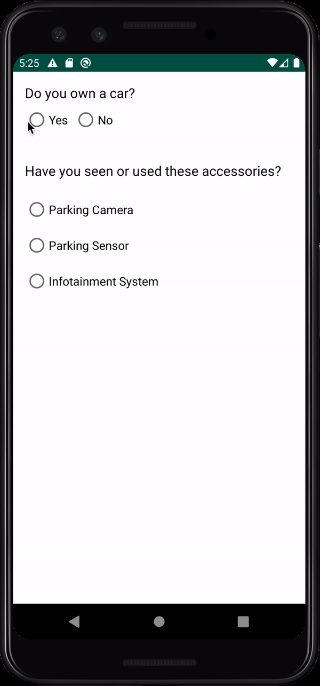

# GenericRVAdapter

This sample application gives an example of using a generic RecylerView adapter which can be used by multiple RecylerViews from different fragments. 

This helps in reducing boiler-plate code and removing all the business logic out of the RV adapter and pushing it into the ViewModel.

Check out [this](https://medium.com/@kunalchaubal/implementing-geofencing-without-googles-geofencing-api-cc29b380c7c9) article which explains this functionality in detail

#### Framework used for dependency injection: [Koin](https://github.com/InsertKoinIO/koin)
